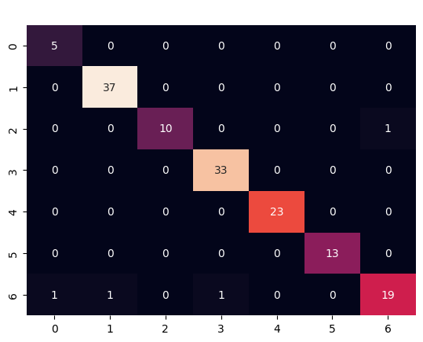
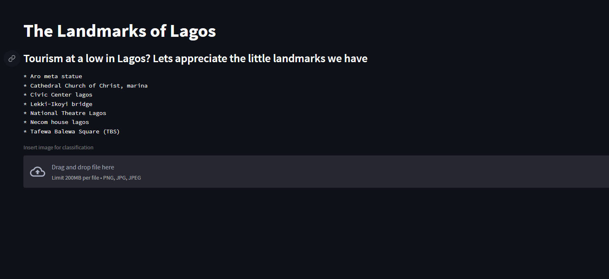

# The Landmarks of Lagos

[Check it Out!](https://eyes-of-landmarks.streamlit.app/)
___
The aim of this project is to build an application that can classify seven (7) popular architectural landmarks that can be found in Lagos state, Nigeria. These landmarks include

* Aro Meta Statue

    *    

 

* Cathedral Church of Christ, Marina

    *    

 

* Civic Center & Towers Lagos

    *    

 

* Lekki-Ikoyi Link Bridge

    *    

 

* National theatre lagos

    *    

 

* Necom house lagos

    *    

 

* Tafawa Balewa Square (TBS)

    *    

___
The data was scraped using the [Google Image Scraper](https://github.com/ohyicong/Google-Image-Scraper) tool to extract all the images from Google

___

* Extracted the data 

* Arranged and label the data

* Performed various Data Preprocessing techniques such as converting images into tensors and feature normalization/scaling

* Convolutional Neural Networks (CNN) using Data Augmentation and Transfer Learning / Pretrained Model to achieved best performance

* **Tuned Inception V3** achieved best performance with **99% training accuracy** and **97.2% test accuracy**

<!-- * Model was deployed on a web application built using **Django** available at [Dementia Predictor](https://dementia-predictor.herokuapp.com/) -->
___
## Model Performamce
Accuracy with Confusion Matrix was used to evaluate performance. 

* **Tuned Inception V3 with Data Augmentation**
    * Training Accuracy : 99%
    * Testing Accuracy : 97.2%
    * Confusion Matrix
    
___
## Model Deployment
The final model with the best score was deployed on a web application built with **Streamlit**

___ 
